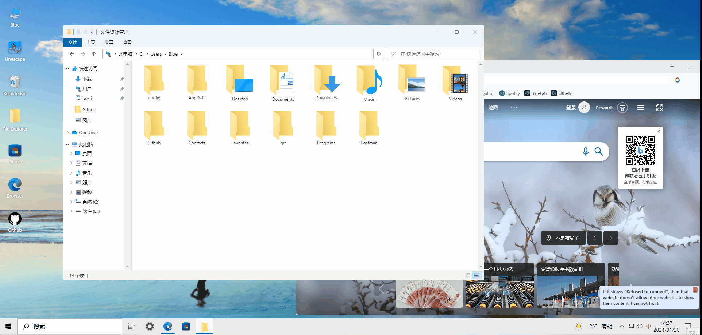
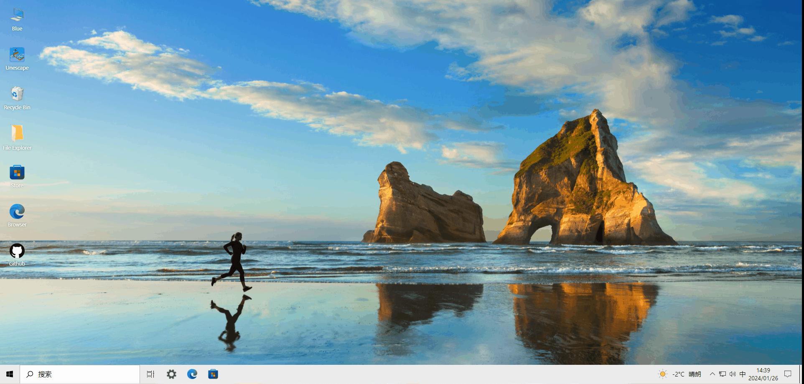
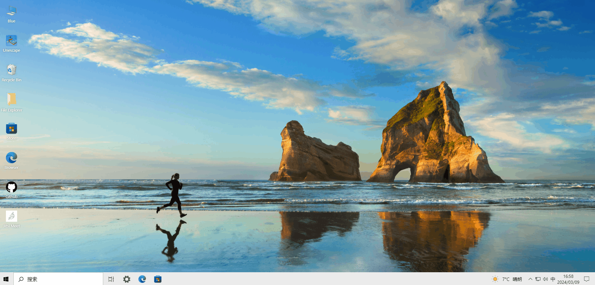

# Win10React
## 安装与使用
```
npm i 
npm run dev
```
## 提示
提示根据所在地区网络不同部分图片或者连接加载缓慢，体验者最好可以科学上网或使用国内备份地址  
<https://gitee.com/chen_ji_xue/win10React>
## 演示网址  
<https://chenjixue.github.io/win10ReactSite>  
<https://chen_ji_xue.gitee.io/win10reactsite>（墙内备份部署，速度快但是部署经常失败）
## 功能模块演示
开始菜单
  
搜索菜单
  
底部任务栏显示与移动
  
侧边栏与一些系统控件显示
  
新增应用下载功能
  